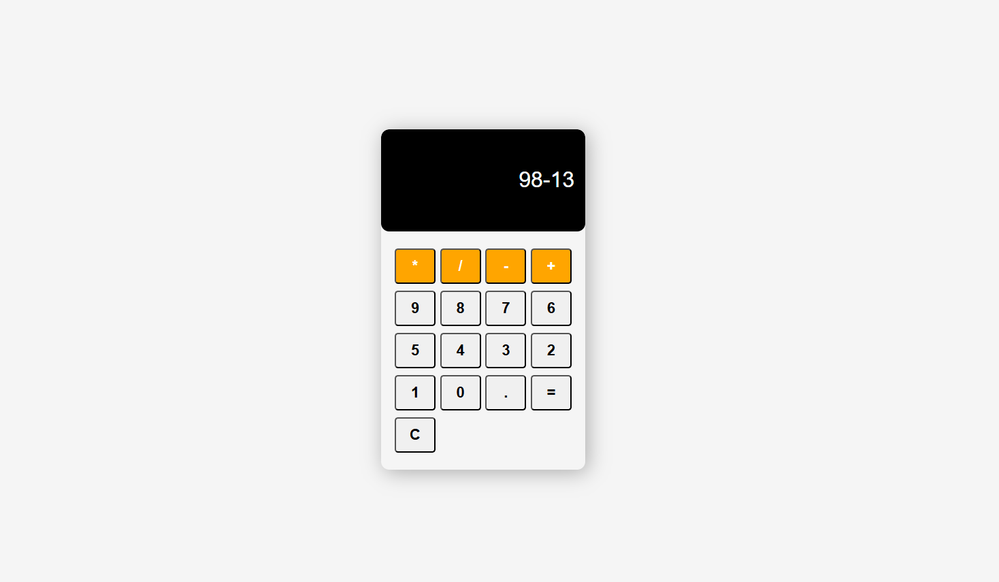

# 🧮 Calculator App

This **Calculator App** is a simple, responsive, and user-friendly tool for performing basic arithmetic operations. Built using HTML, CSS, and JavaScript, it works seamlessly across all devices.

---

## Features

- **Basic Arithmetic**: Supports addition, subtraction, multiplication, and division.
- **Responsive Design**: Optimized for desktops, tablets, and mobile devices.
- **Clean UI**: Minimalistic and modern interface for easy usage.
- **Lightweight**: Fast and efficient with no external dependencies.

---
  

---

## Technologies Used

- **HTML5** for structuring the app.
- **CSS3** for styling and responsive design.
- **JavaScript (ES6)** for the calculator's functionality.

---
